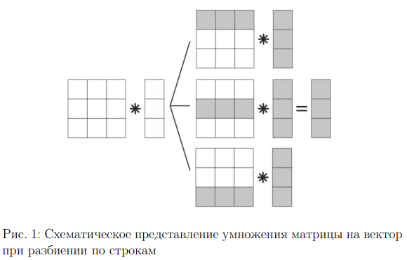
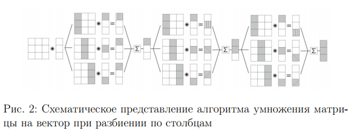
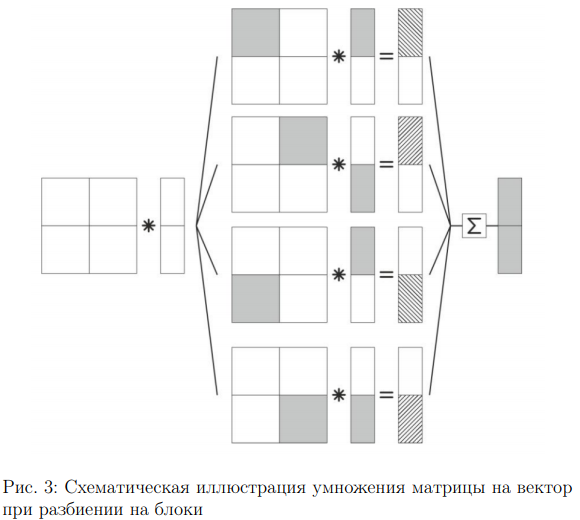

</pre>
Задание на 6 — 7
Реализуйте на языке C или C++ с использованием библиотеки
Pthreads алгоритмы для умножения матриц, используя разбиение по
строкам, по столбцам и по блокам. Проведите численные эксперимен-
ты, замеряя время выполнения функций при различных размерах
входных данных. Постройте графики времени выполнения, ускоре-
ния и эффективности. Сделайте выводы о быстродействии рассмот-
ренных трех алгоритмов.

Задание на 8 — 10
В дополнение к предыдущему заданию, реализуйте параллельный 
алгоритм для вычисления QR-разложения матрицы.

</pre>